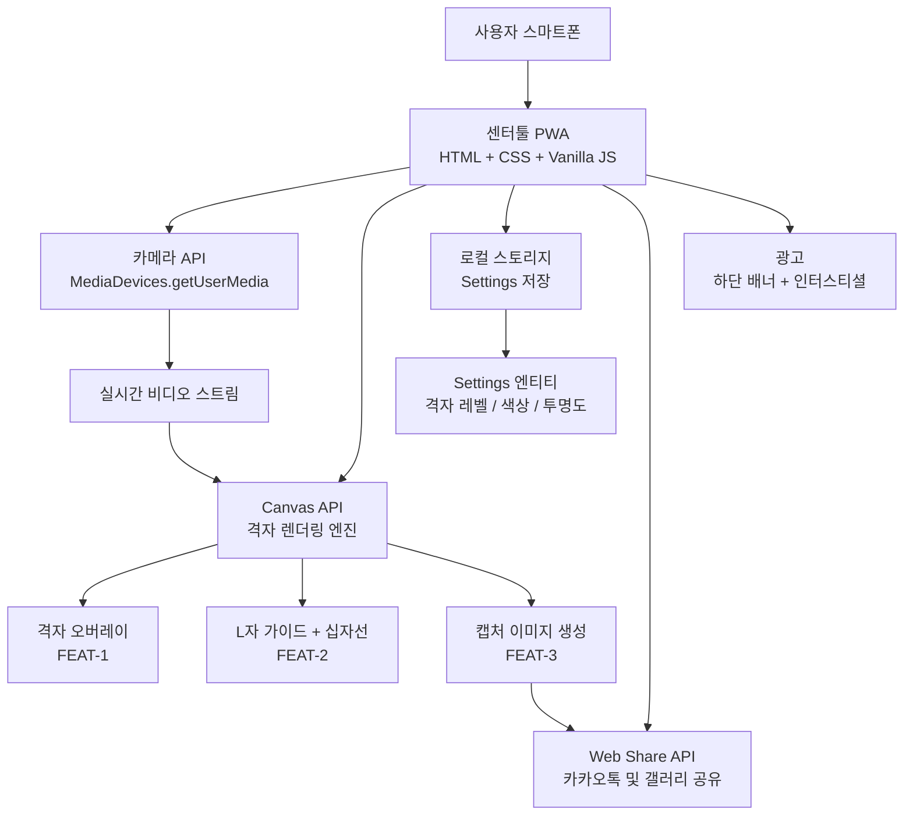

# 센터툴 (CenterTool) — TRD
> 프로젝트명: 센터툴 (CenterTool) | 버전: v1.0 | 생성일: 2026-06-09 KST  
> 작성 기준: SSOT (FEAT-1/2/3, 엔티티: Settings, 용어집 → PRD 참조)

---

## 1. 시스템 아키텍처

센터툴은 **서버 없는 완전 클라이언트 사이드** 구조다.  
모든 로직이 사용자 기기에서 실행되며, 외부 서버로 데이터가 전송되지 않는다.

---

## 2. 권장 기술 스택

| 영역 | 선택 기술 | 선택 이유 | 대안 | 벤더 락인 리스크 |
|------|----------|----------|------|----------------|
| 언어 | HTML + CSS + Vanilla JavaScript | 프레임워크 불필요, 빠른 로딩, 유지보수 단순 | React, Vue | 없음 (표준 웹) |
| PWA | Web App Manifest + Service Worker | 앱스토어 없이 설치, 오프라인 지원 | 네이티브 앱 | 없음 |
| 카메라 | MediaDevices.getUserMedia API | 브라우저 표준, 라이브러리 불필요 | WebRTC 라이브러리 | 없음 |
| 격자 렌더링 | HTML5 Canvas API | 실시간 그래픽 처리 최적, 캡처와 일관성 | SVG Overlay | 없음 |
| 공유 | Web Share API | 카카오톡 포함 전체 앱으로 공유, 구현 간단 | 카카오 SDK | 낮음 |
| 데이터 저장 | Browser localStorage | 서버 불필요, 기기 로컬 저장, 즉시 읽기/쓰기 | IndexedDB | 없음 |
| 광고 | Google AdSense 또는 Kakao AdFit | 설정 간단, 무료 시작 | 자체 광고 | 낮음 |
| 배포 | GitHub Pages 또는 Vercel | 무료, 자동 배포, HTTPS 기본 제공 | Netlify | 낮음 |

---

## 3. 비기능 요구사항

### 성능
- 카메라 스트림 → 격자 오버레이 렌더링 지연: **16ms 이하** (60fps 목표)
- 앱 첫 로딩: **2초 이내** (LTE 기준)
- 캡처 → 저장 완료: **1초 이내**
- 격자 레벨 전환: **즉시** (애니메이션 없음)

### 보안
- 카메라 접근 권한: 사용자 명시적 허용 필요 (브라우저 표준)
- 저장 데이터: 격자 설정값만 (개인정보 없음)
- **HTTPS 필수**: 카메라 API는 보안 컨텍스트(HTTPS)에서만 작동
- 외부 전송 데이터 없음: 모든 처리가 기기 내에서 완결

### 확장성
- 정적 파일만 서빙 → 사용자 수 무관하게 확장 가능 (서버 부하 없음)
- CDN 배포 시 무제한 동시 접속 가능

### 가용성
- Service Worker로 앱 파일 캐싱 → 오프라인 상태에서도 앱 실행 가능
- 단, 카메라는 기기 하드웨어 의존 (오프라인 영향 없음)

---

## 4. DB 요구사항 (로컬 스토리지 기반)

### 스키마 원칙
- 단일 키(`centertool_settings`) 하나의 JSON 객체로 통합 관리
- 키 이름은 앱 이름을 접두사로 사용하여 다른 앱과 충돌 방지

### 저장 항목 (Settings 엔티티)
| 필드 | 설명 | FEAT 연결 | 기본값 |
|------|------|----------|--------|
| grid_level | 격자 밀도 레벨 (lv1 / lv2 / lv3) | FEAT-1 | lv2 |
| grid_color | 격자 색상 | FEAT-1 | #FF6B00 |
| grid_opacity | 격자 투명도 (0.0 ~ 1.0) | FEAT-1 | 0.7 |
| guide_visible | L자 가이드 표시 여부 | FEAT-2 | true |
| crosshair_visible | 중앙 십자선 표시 여부 | FEAT-2 | true |
| updated_at | 마지막 설정 변경 시각 | — | 현재 시각 |

### 인덱싱 원칙
- 로컬 스토리지 특성상 인덱싱 불필요
- 전체 Settings를 단일 읽기/쓰기로 처리 (개별 필드 분리 저장 금지)

---

## 5. 접근제어 및 권한 정책

| 권한 종류 | 요청 시점 | 거부 시 처리 |
|----------|----------|------------|
| 카메라 권한 | 앱 첫 실행 시 | 권한 허용 안내 화면 표시 + 재시도 버튼 |
| 갤러리 저장 권한 (iOS) | 저장 버튼 클릭 시 | Web Share API 공유 방식으로 자동 전환 |
| 로컬 스토리지 접근 | 자동 (별도 권한 없음) | 접근 실패 시 기본값 유지 |

---

## 6. 데이터 생명주기

| 데이터 종류 | 수집 시점 | 보존 기간 | 삭제 방법 |
|-----------|----------|----------|----------|
| 격자 설정값 (Settings) | 사용자가 레벨 변경 시 | 브라우저 데이터 삭제 전까지 | 브라우저 캐시 삭제 시 자동 삭제 |
| 캡처 이미지 | 캡처 버튼 클릭 시 | 갤러리에 저장 (앱 외부 관리) | 사용자가 갤러리에서 직접 삭제 |
| 서버 로그 | 없음 (서버 없음) | — | — |
| 개인정보 | 수집하지 않음 | — | — |

---

## 7. 배포 및 호스팅

### 권장 배포 방법
- **1순위: GitHub Pages** — 무료, Git push로 자동 배포, HTTPS 기본 제공
- **2순위: Vercel** — 무료 플랜, 자동 HTTPS, 빠른 CDN
- 커스텀 도메인 연결 권장 (예: centertool.kr)

### 예상 비용 (연간)
| 항목 | 비용 |
|------|------|
| 호스팅 (GitHub Pages / Vercel 무료 플랜) | 0원 |
| 도메인 (선택 사항) | 연 1~2만원 |
| 서버 운영비 | 0원 (서버 없음) |
| **합계** | **0 ~ 2만원/년** |

### 확장 전략
- 사용자 급증해도 서버 비용 없음 (정적 파일 CDN 배포)
- 기능 추가 시 JS 모듈 파일만 추가하면 됨

---

## 8. 외부 API 및 서비스

| 서비스 | 용도 | 연동 방식 | 대체 서비스 | 비용 |
|--------|------|----------|-----------|------|
| Web Share API | 카카오톡 및 갤러리 공유 (FEAT-3) | 브라우저 표준 API (키 없음) | 카카오 공유 SDK | 무료 |
| Google AdSense | 하단 배너 + 저장 시 인터스티셜 광고 | `<script>` 태그 삽입 | Kakao AdFit | 무료 (수익 발생) |
| GitHub Pages / Vercel | 정적 파일 호스팅 | Git 연동 자동 배포 | Netlify | 무료 |
