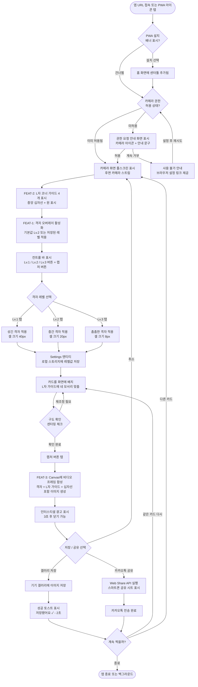
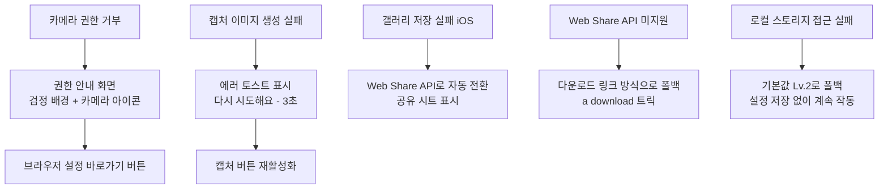
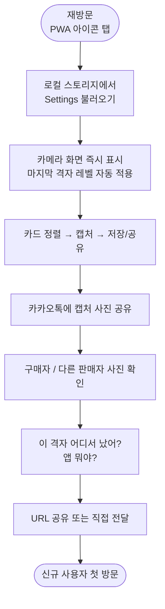

# 센터툴 (CenterTool) — User Flow
> 프로젝트명: 센터툴 (CenterTool) | 버전: v1.0 | 생성일: 2026-06-09 KST  
> 작성 기준: SSOT (FEAT-1/2/3 노드 매칭, 성공/실패 분기, 리텐션 루프 포함)

---

## MVP 핵심 여정 (FEAT-1 + FEAT-2 + FEAT-3 전체)

---

## 실패 분기 상세

---

## 재방문 여정 — 리텐션 루프 (Sticky Loop)

---

## FEAT ↔ Flow 노드 매핑

| FEAT | 해당 Flow 노드 |
|------|--------------|
| FEAT-1 | 격자 오버레이 활성화, Lv.1/2/3 선택, 로컬 스토리지 저장 |
| FEAT-2 | L자 코너 가이드 표시, 중앙 십자선 표시, 카드 정렬 단계 |
| FEAT-3 | 캡처 버튼 탭 → 이미지 합성 → 인터스티셜 광고 → 갤러리 저장 / Web Share API |
