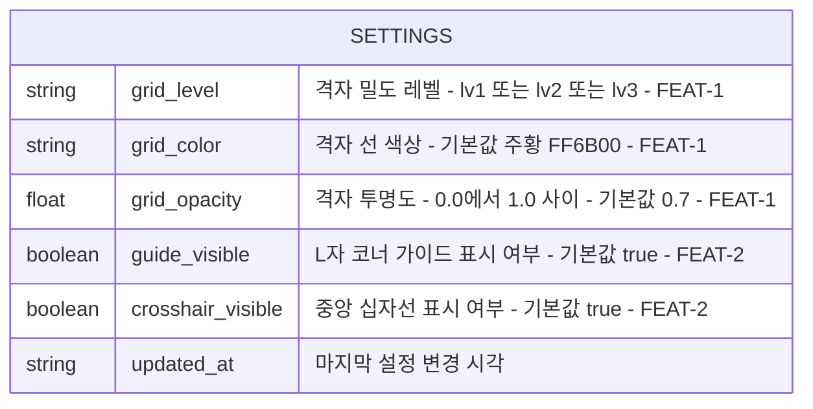

# 센터툴 (CenterTool) — Database Design
> 프로젝트명: 센터툴 (CenterTool) | 버전: v1.0 | 생성일: 2026-06-09 KST  
> 작성 기준: SSOT (엔티티: Settings, FEAT 연결 주석 포함)

---

## 개요

센터툴은 **서버 없는 완전 클라이언트 사이드** 앱이다.  
"데이터베이스"는 사용자 기기의 **브라우저 로컬 스토리지**만 사용하며,  
단 하나의 엔티티(Settings)만 저장한다.

개인정보 수집 없음 / 서버 전송 없음 / 기기 외부로 데이터 유출 없음.

---

## ERD (Entity Relationship Diagram)



> **저장 위치:** 브라우저 로컬 스토리지  
> **저장 키:** `centertool_settings` (단일 JSON 객체)  
> **서버 DB 없음**

---

## 엔티티 상세: Settings

사용자의 마지막 격자 설정을 기기에 저장하는 단일 엔티티.  
앱 재실행 시 이 값을 불러와 마지막 상태를 자동 복원한다.

| 필드명 | 역할 | FEAT 연결 | 기본값 | 허용 값 범위 |
|--------|------|----------|--------|------------|
| grid_level | 격자 밀도 단계 선택 | FEAT-1 | lv2 | lv1 / lv2 / lv3 |
| grid_color | 격자 선 색상 | FEAT-1 | #FF6B00 | 유효한 색상값 |
| grid_opacity | 격자 투명도 | FEAT-1 | 0.7 | 0.0 ~ 1.0 |
| guide_visible | L자 코너 가이드 표시 여부 | FEAT-2 | true | true / false |
| crosshair_visible | 중앙 십자선 표시 여부 | FEAT-2 | true | true / false |
| updated_at | 마지막 설정 변경 시각 기록 | — | 현재 시각 (ISO 8601) | 유효한 날짜 문자열 |

---

## 로컬 스토리지 저장 구조

```
키: "centertool_settings"
값: {
  "grid_level": "lv2",
  "grid_color": "#FF6B00",
  "grid_opacity": 0.7,
  "guide_visible": true,
  "crosshair_visible": true,
  "updated_at": "2026-06-09T12:00:00.000Z"
}
```

---

## 데이터 저장 원칙

1. **수집 최소화:** 측정에 필요한 설정값만 저장. 개인정보, 위치, 기기 정보 수집 없음.
2. **기기 로컬:** 서버 전송 없음. 사용자 기기 밖으로 데이터 유출 없음.
3. **단일 키 원칙:** `centertool_settings` 하나의 JSON 객체로 통합. 개별 필드 분리 저장 금지.
4. **폴백 처리:** 로컬 스토리지 접근 실패 시 기본값으로 폴백하여 앱이 계속 작동.
5. **삭제 용이:** 브라우저 캐시/로컬 스토리지 삭제 시 즉시 초기화.

---

## FEAT ↔ 엔티티 매핑

| FEAT | 관련 Settings 필드 | 설명 |
|------|-----------------|------|
| FEAT-1 | grid_level, grid_color, grid_opacity | 격자 오버레이 렌더링에 직접 사용 |
| FEAT-2 | guide_visible, crosshair_visible | L자 가이드 및 십자선 표시 여부 제어 |
| FEAT-3 | (해당 없음) | 캡처 결과는 갤러리에 저장 — Settings 엔티티 외부 관리 |

---

## 캡처 이미지 데이터 흐름 (FEAT-3)

캡처 이미지는 Settings 엔티티에 저장되지 않는다.  
Canvas에서 생성된 Blob 데이터가 직접 기기 갤러리로 전달된다.

```
Canvas.toBlob() → Blob 데이터 → [갤러리 저장] 또는 [Web Share API]
                                       ↓                    ↓
                               기기 사진 앱에 저장      카카오톡으로 전송
```

이 데이터는 앱 내부에 보관되지 않으며, 앱이 메모리에서 해제되면 사라진다.
